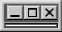
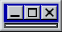
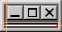
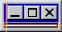

# Glacyers "Old Os Popup" Chat Widget

## Included Files

| path | Border Piece | path | Border Piece |
|--|--|--|--|
| .\textbox\win98\Bottom_Left.png  |  | .\textbox\win98\Left.png |  |
| .\textbox\win98\Bottom_Right.png |  | .\textbox\win98\Right.png |  |
| .\textbox\win98\Bottom.png |  | .\textbox\win98\Top_Left.png |  |
| .\textbox\win98\Center.png |  | .\textbox\win98\Top_Right.png |  |
| .\textbox\win98\Top.png |  | | |

## Visual Examples

    example of how the tilemaps are sliced for these textboxes

</img></img>
 
</img></img>
 
 

    example of how the textboxes animate on stream using the test mode
    boxes grow from the bottom left and stack up before shrinking to the top right
    (ignore broken badges Glacyer doesn't have any when this was made)

## build log
2026 01 22 settings and asset creation 
2026 01 23 :warning:  modifications of core script made 
2026 01 24 tweaks to animation and visuals 
2026 01 25 increased text scale at request 
