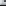
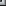
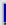
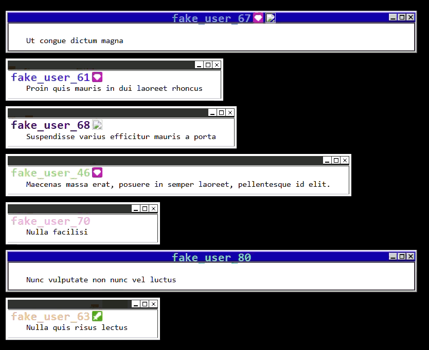

# Glacyers "Old Os Popup" Chat Widget

## Included Files

| path | Border Piece | path | Border Piece |
|--|--|--|--|
| .\textbox\win98\Bottom_Left.png  |  | .\textbox\win98\Left.png |  |
| .\textbox\win98\Bottom_Right.png |  | .\textbox\win98\Right.png |  |
| .\textbox\win98\Bottom.png |  | .\textbox\win98\Top_Left.png |  |
| .\textbox\win98\Center.png |  | .\textbox\win98\Top_Right.png |  |
| .\textbox\win98\Top.png |  | | |

## Visual Examples

    example of how the tilemaps are sliced for these textboxes
    if github supports it these can hovered over to see the unedited image

&nbsp&nbsp&nbsp&nbsp&nbsp&nbsp&nbsp&nbsp

 
 

    example of how the textboxes animate on stream using the test mode
    boxes grow from the bottom left and stack up before shrinking to the top right
    (ignore broken badges Glacyer doesn't have any when this was made)

## build log
2026) 01) 22) settings and asset creation
2026) 01) 23) :warning:  modifications of core script made
2026) 01) 24) tweaks to animation and visuals
